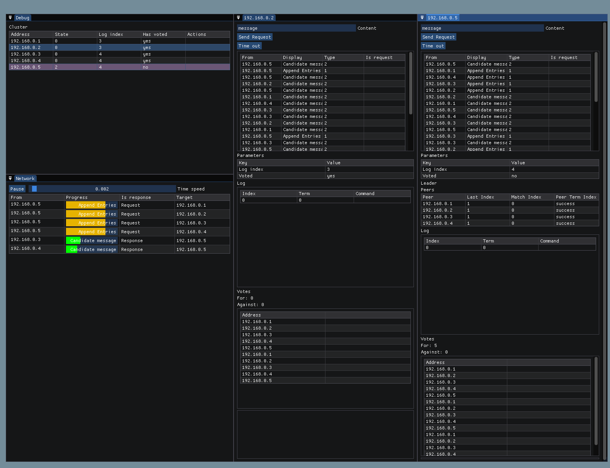

# PDS

Simple visualization for PDS course. Shows different algorithms for distributed systems.



## Files

- src/ - source files
- src/gui/ - GUI related files
- src/raft/ - Raft algorithm
- src/chord/ - Chord algorithm
- src/mutex/ - Mutual exclusion algorithm
- src/network/ - Network related files

## Building

Currently only supports Linux.

Before building, download submodules using:

```bash
git submodule update --init
```

Required libraries:
- GL     - just basic OpenGL, should be available by default
- GLFW   - library for managing windows and OpenGL contexts

To build the project, use Make and choose one algorithm to run:

```bash
$ make raft
$ make chord
$ make mutex
```

This command will create `distr` executable in current directory and run it for chosen algorithm.
